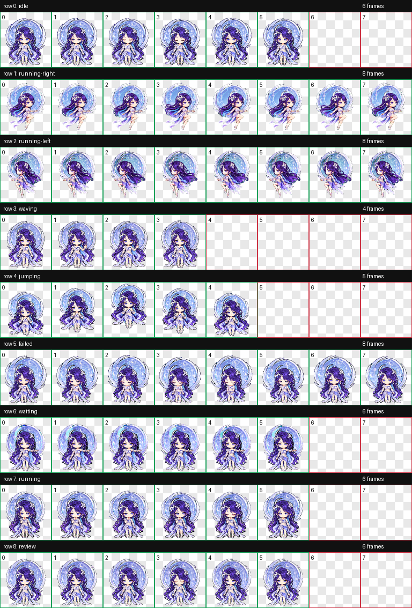

# 海月·幻海映月（原皮）

王者荣耀海月原皮的 Q 版像素桌宠，蓝紫长发、银白衣装，保持高冷、从容的神态。独立琉璃月盘悬浮在人物身后，轻微漂移；左右移动保持一侧抬膝、另一条腿下垂的空中飞行姿态。


## 下载与安装

[下载宠物包 ZIP](haiyue-classic-v3.zip)，解压后在 `haiyue-classic` 文件夹运行安装脚本；也可以只把 [pet.json](pet.json) 与 [spritesheet.webp](spritesheet.webp) 放在 `~/.codex/pets/haiyue-classic/`（Windows 为 `%USERPROFILE%\.codex\pets\haiyue-classic\`）。设置 `CODEX_HOME` 时放在其 `pets/haiyue-classic/` 下。

macOS / Linux：

```sh
sh install.sh
```

Windows PowerShell：

```powershell
powershell -ExecutionPolicy Bypass -File .\install.ps1
```

安装后刷新 Codex 宠物列表，选择「海月·幻海映月」。

## 九种动作

| 待机 | 向右悬浮 | 向左悬浮 |
| :---: | :---: | :---: |
|  |  |  |

| 挥手 | 跳跃 | 失败反应 |
| :---: | :---: | :---: |
|  |  |  |

| 等待输入 | 专注工作 | 审阅结果 |
| :---: | :---: | :---: |
|  |  |  |

[离线动作预览](preview.html)（下载后在浏览器打开，可暂停、放大和切换背景）。

## 动作总览



本版本为 v3 独立月盘修正：九种动作的全部 57 帧都有完整月盘，保留高冷闭嘴表情、抬膝悬浮移动和跳跃升降。

图集为 1536×1872 透明 WebP，8 列 9 行，每格 192×208；格式版本为 1，未使用的格子完全透明。已检查透明背景、逐帧序列、月盘边缘和九组 GIF 的帧数与时长。Codex 实际宠物窗口的连续播放尚未实测。

[带月盘正面参考](front.png)
