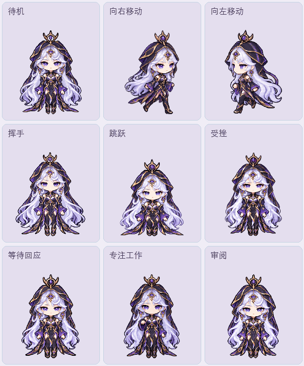

# 海月·真言先知（非白色形态） · Codex Pet

[← 返回宠物目录](../../README.md)

王者荣耀海月「真言先知」非白色形态的像素 Q 版桌面宠物。保留银白长发、黑紫金边兜帽与服饰、紫色宝石和眼形头饰。神态高冷、从容，始终平直闭嘴；致意、思考和受挫反应都保持克制。

 

## 下载与安装

[下载整个仓库 ZIP](https://github.com/Aurora-Selene/Codex-pet-Yixing-HaiYue-from-HOK/archive/refs/heads/main.zip)，解压后进入 `pets/haiyue-zhenyan-dark/`。

macOS / Linux：

```sh
sh install.sh
```

Windows PowerShell：

```powershell
powershell -ExecutionPolicy Bypass -File .\install.ps1
```

也可以手动下载 [pet.json](pet.json) 和 [spritesheet.webp](spritesheet.webp)，放到同一个目录：

- macOS / Linux：`~/.codex/pets/haiyue-zhenyan-dark/`
- Windows：`%USERPROFILE%\.codex\pets\haiyue-zhenyan-dark\`
- 设置了 `CODEX_HOME` 时：其下的 `pets/haiyue-zhenyan-dark/`

安装后刷新 Codex 的宠物列表，选择「海月·真言先知」。

## 九种动作

| 待机 · 6 帧 | 向右移动 · 8 帧 | 向左移动 · 8 帧 |
| :---: | :---: | :---: |
|  |  |  |

| 克制致意 · 4 帧 | 轻盈跳跃 · 5 帧 | 受挫恢复 · 8 帧 |
| :---: | :---: | :---: |
|  |  |  |

| 等待回应 · 6 帧 | 专注思索 · 6 帧 | 思考审阅 · 6 帧 |
| :---: | :---: | :---: |
|  |  |  |

## 动态总览与离线预览



下载 [preview.html](preview.html) 后用浏览器打开，可暂停、调速、逐帧查看及切换背景。所有图像均已内嵌，离线可用。

## 正面主形象


## 图集规格与验证

九种状态共 57 帧；1536×1872 透明 WebP，8 列 9 行，每格 192×208，未使用格子完全透明。左右移动独立绘制；跳跃含准备、升起、最高点、下降与落地。

已检查透明背景、完整轮廓、帧数、逐帧动作、无损图集与网页预览。未发现微笑、脸红、张嘴或夸张卖萌表情。Codex 实际悬浮宠物窗口播放尚未实测。

正面形象和动作由内置 imagegen 生成，脚本用于拆帧、尺寸定位、拼装图集及验证。
