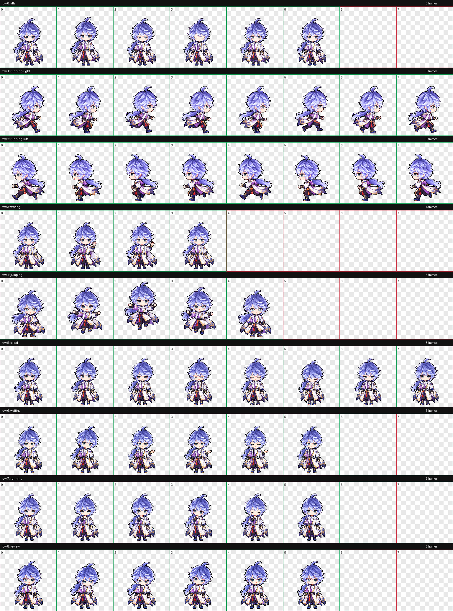

# 弈星·天元之弈 · Codex Pet

[← 返回宠物目录](../../README.md)

王者荣耀弈星原皮「天元之弈」的像素 Q 版桌面伙伴，蓝紫发束、青灰眼睛、白紫金衣装与红色腰饰。左右移动分别绘制，保留不对称衣袖；挥手、跳跃、等待与思考有各自的动作。

 

## 安装

[下载整个仓库](https://github.com/Aurora-Selene/Codex-pet-Yixing-HaiYue-from-HOK/archive/refs/heads/main.zip)，解压后进入 `pets/yixing-classic`。

macOS / Linux：

```sh
sh install.sh
```

Windows PowerShell：

```powershell
powershell -ExecutionPolicy Bypass -File .\install.ps1
```

也可以手动将 [pet.json](pet.json) 和 [spritesheet.webp](spritesheet.webp) 放进 `~/.codex/pets/yixing-classic/`；Windows 默认目录为 `%USERPROFILE%\.codex\pets\yixing-classic`。设置了 `CODEX_HOME` 时使用其下的 `pets/yixing-classic`。安装后在 Codex 中刷新宠物列表，选择「弈星·天元之弈」。

## 九个动作

| 安静待机 · 6 帧 | 向右移动 · 8 帧 | 向左移动 · 8 帧 |
| :---: | :---: | :---: |
|  |  |  |

| 挥手 · 4 帧 | 跳跃 · 5 帧 | 失落反应 · 8 帧 |
| :---: | :---: | :---: |
|  |  |  |

| 等待输入 · 6 帧 | 专注思考 · 6 帧 | 审阅结果 · 6 帧 |
| :---: | :---: | :---: |
|  |  |  |

## 完整动作总览



九种状态共 57 帧；图集为 1536×1872 透明 WebP，8 列 9 行，每格 192×208，未使用格子完全透明。已检查文件、透明背景、逐帧动作与网页预览；Codex 实际悬浮宠物窗口播放尚未实测。

形象及动作使用内置 imagegen 制作，hatch-pet 脚本用于拆帧、拼装图集和检查。
