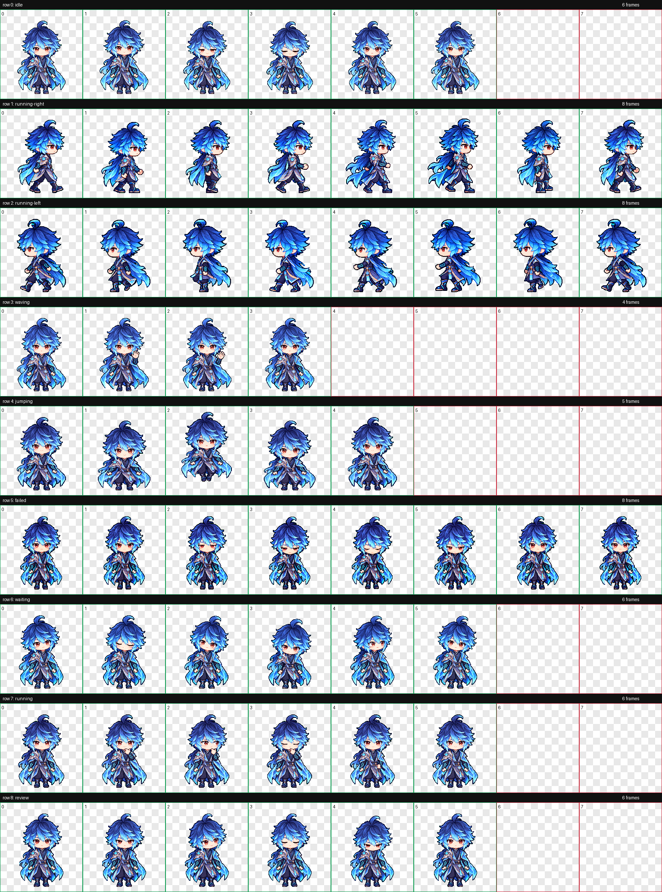

# 弈星·万物之道

王者荣耀弈星「万物之道」的 Q 版像素桌面宠物。深蓝发、青蓝披风、灰蓝长袍，左右肩饰保留原有的不对称设计。

## 动作预览


v3 重绘左右行走的 16 帧，增加前后摆臂，修正膝踝连接、落脚和换腿衔接；其余七种动作保持原样。

| 待机 | 挥手 | 跳跃 |
| :---: | :---: | :---: |
|  |  |  |

| 受挫 | 等待 | 工作 | 审阅 |
| :---: | :---: | :---: | :---: |
|  |  |  |  |

[离线九种动作预览](九种动作预览.html)支持暂停、调速、背景切换和逐帧查看。

## 下载与安装

下载整个仓库后，进入 `pets/yixing-wanwuzhidao/`。

macOS / Linux：

```sh
sh install.sh
```

Windows PowerShell：

```powershell
powershell -ExecutionPolicy Bypass -File .\install.ps1
```

也可以将 [pet.json](pet.json) 和 [spritesheet.webp](spritesheet.webp) 放在同一文件夹 `~/.codex/pets/yixing-wanwuzhidao/`；Windows 路径为 `%USERPROFILE%\.codex\pets\yixing-wanwuzhidao\`。设置了 `CODEX_HOME` 时，使用该目录下的 `pets/yixing-wanwuzhidao/`。

在 Codex 中刷新宠物列表并选择「弈星·万物之道」。

## 规格与验证

透明 WebP 图集为 1536×1872，8 列 9 行，单格 192×208。九种动作共 57 帧，未用格子完全透明。图片由内置 imagegen 生成并局部修补，再提取与拼装。图集、逐帧动作及网页预览已验证；原生悬浮宠物播放尚未现场验证。


